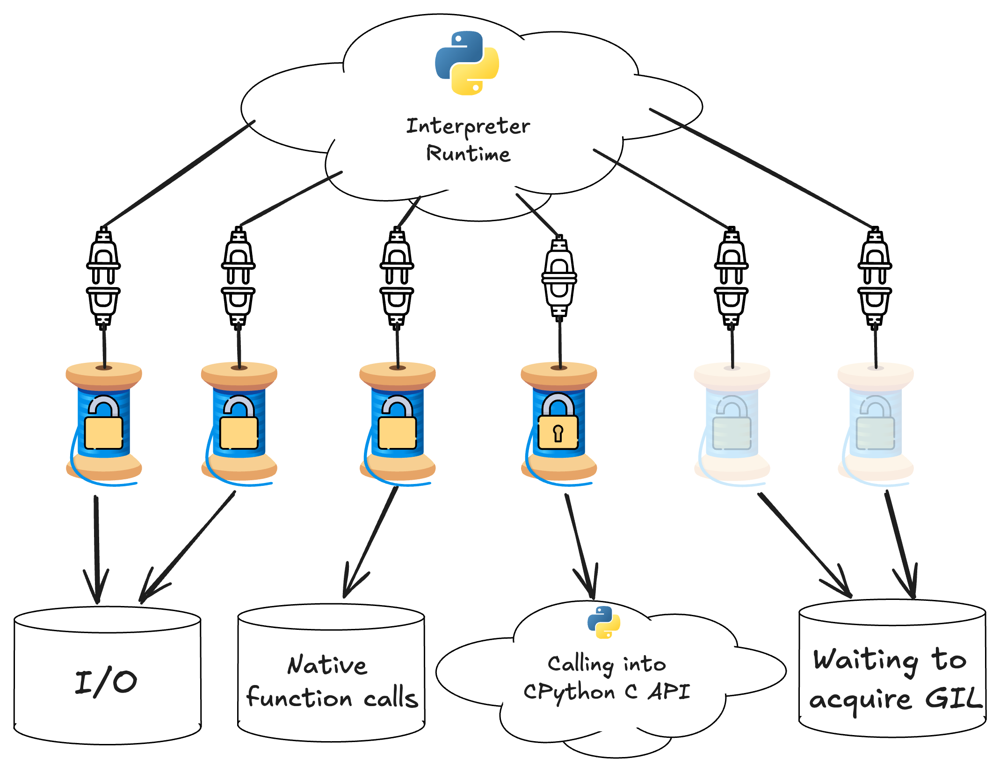
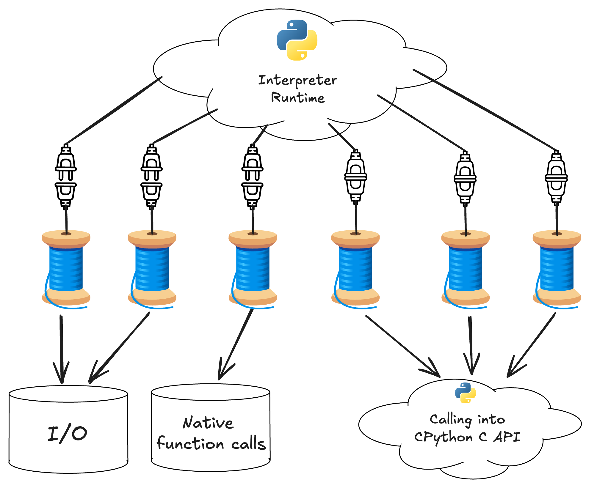
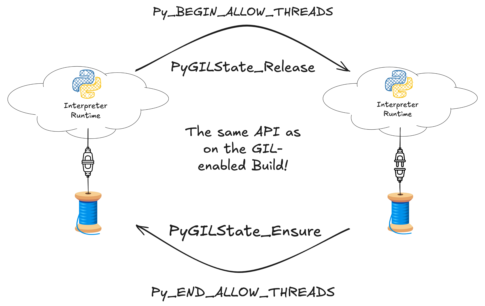

# Updating Extension Modules

Here we are going to re-hash some of the same topics covered in the [previous
section](porting.md) but with a focus on advice for updating native extension
modules, particularly modules relying directly on the CPython C API. The general
advice remains the same: identify supported multithreaded workflows, add
testing, and fix and identified thread safety issues. We will also describe how
to handle some common thread-unsafe patterns we have found in many extension
modules across the open source ecosystem.

## Declaring free-threaded support

Extension modules need to explicitly indicate they support running with the GIL
disabled, otherwise a warning is printed and the GIL is re-enabled at runtime
after importing a module that does not support the GIL.

=== "C API"

    C or C++ extension modules using multi-phase initialization can specify the
    [`Py_mod_gil`](https://docs.python.org/3.13/c-api/module.html#c.Py_mod_gil)
    module slot like this:

    ```c
    static PyModuleDef_Slot module_slots[] = {
        ...
    #ifdef Py_GIL_DISABLED
        {Py_mod_gil, Py_MOD_GIL_NOT_USED},
    #endif
        {0, NULL}
    };
    ```

    The `Py_mod_gil` slot has no effect in the non-free-threaded build.

    Extensions that use single-phase initialization need to call
    [`PyUnstable_Module_SetGIL()`](https://docs.python.org/3.13/c-api/module.html#c.PyUnstable_Module_SetGIL)
    in the module's initialization function:

    ```c
    PyMODINIT_FUNC
    PyInit__module(void)
    {
        PyObject *mod = PyModule_Create(&module);
        if (mod == NULL) {
            return NULL;
        }

    #ifdef Py_GIL_DISABLED
        PyUnstable_Module_SetGIL(mod, Py_MOD_GIL_NOT_USED);
    #endif

        return mod;
    }
    ```

=== "Cython"

    See [the Free threading
    section](https://cython.readthedocs.io/en/latest/src/userguide/freethreading.html)
    in the Cython user guide for detailed recommendations. Keep in mind that
    support for free-threaded Python in Cython code is currently considered
    experimental, so suggestions are subject to change.

    Starting with Cython 3.1.0 extension modules written in Cython can declare
    free-threaded support using the
    [`freethreading_compatible`](https://cython.readthedocs.io/en/latest/src/userguide/source_files_and_compilation.html#compiler-directives)
    compiler directive.

    You can do this in one of
    [several ways](https://cython.readthedocs.io/en/latest/src/userguide/source_files_and_compilation.html#how-to-set-directives),
    e.g., in a source file:

    ```cython
    # cython: freethreading_compatible=True
    ```

    Or by passing the directive when invoking the `cython` executable:

    ```bash
    $ cython -X freethreading_compatible=True
    ```

    Or via a build system specific way of passing directives to Cython.

    !!! tip

        Here are a few examples of how to globally enable the directive in a few popular
        build systems:

        === "setuptools"

            When using setuptools, you can pass the `compiler_directives` keyword argument
            to `cythonize`:

            ```python
            from Cython.Compiler.Version import version as cython_version
            from packaging.version import Version

            compiler_directives = {}
            if Version(cython_version) >= Version("3.1.0"):
                compiler_directives["freethreading_compatible"] = True

            setup(
                ext_modules=cythonize(
                    extensions,
                    compiler_directives=compiler_directives,
                )
            )
            ```

        === "Meson"

            When using Meson, you can add the directive to the `cython_args` you're
            passing to `py.extension_module`:

            ```meson
            cy = meson.get_compiler('cython')

            cython_args = []
            if cy.version().version_compare('>=3.1.0')
                cython_args += ['-Xfreethreading_compatible=True']
            endif

            py.extension_module('modulename'
                'source.pyx',
                cython_args: cython_args,
                ...
            )
            ```

            You can also globally add the directive for all Cython extension modules:

            ```meson
            cy = meson.get_compiler('cython')
            if cy.version().version_compare('>=3.1.0')
                add_project_arguments('-Xfreethreading_compatible=true', language : 'cython')
            endif
            ```

=== "Pybind11"

    C++ extension modules making use of `pybind11` can easily declare support for
    running with the GIL disabled via the
    [`gil_not_used`](https://pybind11.readthedocs.io/en/stable/reference.html#_CPPv4N7module_23create_extension_moduleEPKcPKcP10module_def16mod_gil_not_used)
    argument to `create_extension_module`. Example:

    ```cpp
    #include <pybind11/pybind11.h>
    namespace py = pybind11;

    PYBIND11_MODULE(example, m, py::mod_gil_not_used()) {
        ...
    }
    ```

=== "nanobind"

    C++ extension modules making use of `nanobind` can declare support for
    running with the GIL disabled by passing the
    [`FREE_THREADED`](https://nanobind.readthedocs.io/en/latest/free_threaded.html#opting-in)
    argument to the `nanobind_add_module` CMake target command. Example:

    ```cmake
    nanobind_add_module(
      my_ext                   # Target name
      FREE_THREADED            # Opt into free-threading
      my_ext.h                 # Source code files below
      my_ext.cpp)
    ```

=== "PyO3"

    If you use the CPython C API in Rust via [PyO3](https://pyo3.rs), then you
    can follow the [PyO3 Guide
    section](https://pyo3.rs/latest/free-threading.html) on supporting
    free-threaded Python. You must also update your extension to at least
    version 0.23.

    You should write multithreaded tests of any code you expose to Python. See
    our guide on [updating test suites](testing.md#fixing-thread-unsafe-tests) for
    more details. You should fix any thread safety issues you discover while
    running multithreaded tests.

    As of PyO3 0.23, PyO3 enforces Rust's borrow checking rules at
    runtime and may produce runtime panics if you simultaneously mutably borrow
    data in more than one thread. You may want to consider storing state in using
    atomic data structures, with mutexes or locks, or behind `Arc`
    pointers.

    Once you are satisfied the Python modules defined by your rust crate are
    thread safe, you can pass `gil_used = false` to the [`pymodule`
    macro](https://docs.rs/pyo3/latest/pyo3/attr.pymodule.html):

    ```rust

    #[pymodule(gil_used = false)]
    fn my_module(py: Python, m: &Bound<'_, PyModule>) -> PyResult<()> {
        ...
    }
    ```

    If you define any modules procedurally by manually creating a `PyModule`
    struct without using the `pymodule` macro, you can call
    [`PyModuleMethods::gil_used`](https://docs.rs/pyo3/latest/pyo3/prelude/trait.PyModuleMethods.html#tymethod.gil_used)
    after instantiating the module.

    If you use the `pyo3-ffi` crate and/or `unsafe` FFI calls to call directly into the C
    API, then see the section on porting C extensions in this guide as well as
    the PyO3 source code.

=== "f2py"

    Starting with NumPy 2.1.0, extension modules containing f2py-wrapped
    Fortran code can declare they are thread-safe and support free-threading
    using the
    [`--freethreading-compatible`](https://numpy.org/devdocs/f2py/usage.html#extension-module-construction)
    command-line argument:

    ```bash
    $ python -m numpy.f2py -c code.f -m my_module --freethreading-compatible
    ```

If you publish binaries and have downstream libraries that depend on your
library, we suggest adding support as described above and uploading nightly wheels
as soon as basic support for the free-threaded build is established in the
development branch. This will ease the work of libraries that depend on yours
to also add support for the free-threaded build.

## Working with the free-threaded CPython interpreter runtime

Many people are surprised to learn that almost all native extensions written
with the GIL-enabled build in mind compile and run with minimal changes on the
free-threaded build. They often ask questions like, "if there is no GIL, doesn't
that mean there's no need to call e.g. `PyGilState_Ensure()` before calling into
the C API and no need to call `Py_BEGIN_ALLOW_THREADS` to release the GIL before
doing I/O or a long-running computation?". Bindings generators like Cython, PyO3,
or Pybind11 all also have syntax for explicitly acquiring and releasing the
GIL. Won't all this code need to change?

The answer is no. To understand, let's first take a look at the diagram below,
which illustrates a snapshot of the state of a multithreaded Python application
that has native extensions.

{ width="600" }

/// caption
A diagramatic snapshot of the state of a multithreaded Python
application running on the GIL-enabled interpreter
///

In this diagram, each thread spindle symbol represents a thread that is running
code inside a native extension. The lock icon indicates whether the thread holds
the GIL - only one thread can acquire the GIL at a time, indicated by the
fastened lock on the thread calling into the CPython C API. The bottom row of
symbols indicates what work each thread is doing. You can see that even with
the GIL it is possible to get multithreaded parallelism, so long as there are
threads that do not have the GIL acquired and are not waiting to acquire the
GIL. Usually, this means a thread is doing I/O or a long-running calculation
that does not need any state or functionality from the CPython runtime.

In addition to the lock icon indicating whether the GIL is acquired, each thread
icon is either plugged in or unplugged from the interpreter runtime, indicating
it has an attached or detached thread state. In the GIL-enabled build, only
one thread can have an attached thread state and hold the GIL, while all
other unplugged threads wait for the GIL to be released.

In the free-threaded build the GIL is disabled but threads can still either have
attached or detached thread states. As in the GIL-enabled build, only attached
threads can use interpreter state but, because there is no GIL, many threads can
simultaneously call into the CPython C API.

The state of a running free-threaded application is illustrated in the diagram below.

{ width="600" }

/// caption
A diagramatic snapshot of the state of a multithreaded Python
application running on the free-threaded-enabled interpreter
///

In the free-threaded build, the GIL is disabled, so this diagram doesn't have lock
icons. Because there is no GIL, threads do not need to wait to acquire it, and
multiple threads can simultaneously call into the CPython C API.

The icons indicating whether threads are attached or detached are still
present. As discussed above, this is because it is still necessary to explicitly
attach and detach from the runtime in the free-threaded build, despite the fact
that there isn't a GIL.

You might wonder why it's still necessary to detach from the runtime when doing
I/O or a long-running native calculation. This is because there are still times
when the interpreter needs to globally synchronize the state of all threads. For
example, the free-threaded interpreter uses a stop-the-world garbage collection
scheme, which requires all threads to be detached from the runtime before it can
start. If you don't explicitly detach before doing a long-running operation that
does not require the runtime, the interpreter may be blocked on running the
garbage collector or doing any other operation that requires a globally
consistent view of all threads.

{ width="600" }

/// caption
Attaching and detaching from the runtime uses the same
code as in the GIL-enabled build
///

As illustrated above, attaching and detaching from the runtime uses exactly the
same code in the free-threaded build as is used in the GIL-enabled build to
acquire and release the GIL. It is an unfortunate naming issue that
`PyGILState_Ensure` and `PyGILState_Release` has "`GIL`" in the name of the
function, despite the lack of a GIL on the free-threaded build. It's likely that
the C API in future Python version will fix this naming issue.

Hopefully you now have a better mental model for how native code interacts with
the CPython interpreter runtime in the free-threaded build and how it is similar
to what happens on the GIL-enabled build, and what exactly it means for multiple
threads to simultaneously execute Python code.

You might also see how extension modules written assuming that Python can call
into the extension in one thread at a time might lead to problematic
thread-unsafe behavior. Doubly so now that more than one Python thread can
simultaneously access any state stored in the extension in the free-threaded
build.

## Porting C Extensions

The CPython C API exposes the `Py_GIL_DISABLED` macro in the free-threaded
build. You can use it to enable low-level code that only runs under the
free-threaded build, isolating possibly performance-impacting changes to the
free-threaded build:

```c
#ifdef Py_GIL_DISABLED
// free-threaded specific code goes here
#endif

#ifndef Py_GIL_DISABLED
// code for gil-enabled builds goes here
#endif
```

## Locking and Synchronization Primitives

### Native mutexes

If your extension is written in C++, Rust, or another modern language that
exposes locking primitives in the standard library, you should consider using
the locking primitives provided by your language or framework to add locks when
needed.

If you need to call arbitrary Python code while the lock is held, care
should be taken to avoid creating deadlocks with the GIL on the GIL-enabled
build.

### `PyMutex`

For C code or C-like C++ code, the CPython 3.13 C API exposes
[`PyMutex`](https://docs.python.org/3.13/c-api/init.html#c.PyMutex), a
high-performance locking primitive that supports static allocation. As of
CPython 3.13, the mutex requires only one byte for storage, but future versions
of CPython may change that, so you should not rely on the size of `PyMutex` in
your code.

You can use `PyMutex` in both the free-threaded and GIL-enabled build of Python
3.13 or newer. `PyMutex` is hooked into the CPython runtime, so that if a thread
tries to acquire the mutex and ends up blocked, garbage collection can still
proceed and, in the GIL-enabled build, the blocked thread releases the GIL,
allowing other threads to continue running. This implies that it is impossible
to create a deadlock between a `PyMutex` and the GIL. For this reason, it is not
necessary to add code for the GIL-enabled build to ensure the GIL is released
before acquiring a `PyMutex`. If you do not call into the CPython C API while
holding the lock, `PyMutex` has no special advantages over other mutexes, besides
low-level details like performance or the size of the mutex object in memory.

See the section on [dealing with thread-unsafe low-level
libraries](porting-extensions.md#dealing-with-thread-unsafe-native-libraries)
below for an example using PyMutex to lock around a thread-unsafe C library.

### Critical Sections

Python 3.13 or newer also offers a [critical section
API](https://docs.python.org/3/c-api/init.html#python-critical-section-api) that
is useful for locking either a single object or a pair of objects during a
low-level operation. The critical section API is intended to provide weaker, but
still useful locking guarantees compared to directly locking access to an object
using a mutex. This provides similar guarantees to the GIL and avoids
the risk of deadlocks introduced by locking individual objects.

The main difference compared with using a per-object lock is that active
critical sections are suspended if a thread calls `PyEval_SaveThread` (e.g. when
the GIL is released on the GIL-enabled build), and then restored when the thread
calls `PyEval_RestoreThread` (e.g. when the GIL is re-acquired on the
GIL-enabled build). This means that while the critical sections are suspended,
it's possible for any thread to re-acquire a thread state and mutate the locked
object. This can also happen with the GIL, since the GIL is a re-entrant lock,
and extensions are allowed to recursively release and acquire it in an
interleaved manner.

Critical sections are most useful when implementing the low-level internals of a
custom object that you fully control. You can apply critical sections around
modification of internal state to effectively serialize access to that state.

See the section below on [dealing with thread-unsafe
objects](porting-extensions.md#dealing-with-thread-unsafe-objects) for an example using
the critical section API.

## Dealing with global state

Many CPython C extensions make strong assumptions about the GIL. For example,
before NumPy 2.1.0, the C code in NumPy made extensive use of C static global
variables for storing settings, state, and caches. With the GIL, it is possible
for Python threads to produce non-deterministic results from a calculation, but
it is not possible for two C threads to simultaneously see the state of the C
global variables, so no data races are possible.

In free-threaded Python, global state like this is no longer safe against data
races and undefined behavior in C code. A cache of `PyObject` pointers stored in
a C global array can be overwritten simultaneously by multiple Python threads,
leading to memory corruption and segfaults.

### Converting global state to thread local-state

Often the easiest way to fix data races due to global state is to convert the
global state to thread local state.

Python and Cython code can make use of
[`threading.local`](https://docs.python.org/3/library/threading.html#thread-local-data)
to declare a thread-local Python object. C and C++ code can also use the
[`Py_tss API`](https://docs.python.org/3/c-api/init.html#thread-specific-storage-tss-api)
to store thread-local Python object references. [PEP
539](https://peps.python.org/pep-0539) has more details about the `Py_tss` API.

Low-level C or C++ code can make use of the
[`thread_local`](https://en.cppreference.com/w/c/thread/thread_local) storage
specified by recent standard versions. Note that standardization of
thread-local storage in C has been slower than C++, so you may need to use
platform-specific definitions to declare variables with thread-local
storage. Also note that thread-local storage on MSVC has
[caveats](https://learn.microsoft.com/en-us/cpp/parallel/thread-local-storage-tls?view=msvc-170#rules-and-limitations),
and you should not use thread-local storage for anything besides statically
defined integers and pointers.

NumPy has a [`NPY_TLS`
macro](https://github.com/numpy/numpy/blob/b77d2c6cc214cdcde567f356688ebddb2a5e7c8c/numpy/_core/include/numpy/npy_common.h#L116-L128)
in the `numpy/npy_common.h` header. While you can include the numpy header and
use `NPY_TLS` directly on NumPy 2.1 or newer, you can also add the definition
to your own codebase, along with some build configuration tests to test for the
correct definition to use.

### Making global caches thread-safe

Global caches are also a common source of thread safety issues. For example, if
a function requires an expensive intermediate result that only needs to be
calculated once, many C extensions store the result in a global variable. This
can lead to data races and memory corruption if more than one thread
simultaneously tries to fill the cache.

If the cache is not critical for performance, consider simply disabling the
cache in the free-threaded build:

```c
static int *cache = NULL;

int my_function_with_a_cache(void) {
    int *my_cache = NULL;
#ifndef Py_GIL_DISABLED
    if (cache == NULL) {
        cache = get_expensive_result();
    }
    my_cache = cache;
#else
    my_cache = get_expensive_result();
#endif;
    // use the cache
}
```

CPython holds a per-module lock during import. This lock can be released to
avoid deadlocks in unusual cases, but in most situations module initialization
happens exactly once per interpreter in one C thread. Modules using static
single-phase initialization can therefore set up per-module state in the
`PyInit` function without worrying about concurrent initialization of modules in
different threads. For example, you might set up a global static cache that is
read-only after module initialization like this:

```c
static int *cache = NULL;

PyMODINIT_FUNC
PyInit__module(void)
{
    PyObject *mod = PyModule_Create(&module);
    if (mod == NULL) {
        return NULL;
    }

    // don't need to lock or do anything special
    cache = setup_cache();

    // do rest of initialization
}
```

You can then read from `cache` at runtime in a context where you know the module
is initialized without worrying about whether or not the per-module static cache
is initialized.

If the cache is critical for performance, cannot be generated at import time,
but generally gets filled quickly after a program begins, then you will need to
use a single-initialization API to ensure the cache is only ever initialized
once. In C++, use
[`std::once_flag`](https://en.cppreference.com/w/cpp/thread/once_flag) or
[`std::call_once`](https://en.cppreference.com/w/cpp/thread/call_once).

C does not have an equivalent portable API for single initialization. If you
need that, take a look at [this NumPy
PR](https://github.com/numpy/numpy/pull/26780) for an example using atomic
operations and a global mutex.

If the cache is in the form of a data container, then you can lock access to
the container, like in the following example:

```c

#ifdef Py_GIL_DISABLED
static PyMutex cache_lock = {0};
#define LOCK() PyMutex_Lock(&cache_lock)
#define UNLOCK() PyMutex_Unlock(&cache_lock)
#else
#define LOCK()
#define UNLOCK()
#endif

static int *cache = NULL;
static PyObject *global_table = NULL;

int initialize_table(void) {
    // called during module initialization
    global_table = PyDict_New();
    return;
}

int function_accessing_the_cache(void) {
    LOCK();
    // use the cache

    UNLOCK();
}

```

!!! note

    Note that, while the NumPy PR linked above uses `PyThread_type_lock`, that is
    only because `PyMutex` was not part of the public Python C API at the time. We
    recommend always using `PyMutex`. For pointers on how to do that, check
    [this NumPy PR](https://github.com/numpy/numpy/pull/27011) that ports all
    `PyThread_type_lock` usages to `PyMutex`.

## Dealing with thread-unsafe native libraries

Many C, C++, and Fortran libraries are not written in a thread-safe manner. It
is still possible to call these libraries from free-threaded Python, but
wrappers must add appropriate locks to prevent undefined behavior.

There are two kinds of thread unsafe libraries: reentrant and non-reentrant. A
reentrant library generally will expose state as a struct that must be passed
to library functions. So long as the state struct is not shared between
threads, functions in the library can be safely executed simultaneously.

Wrapping reentrant libraries requires adding locking whenever the state struct
is accessed.

```c
typedef struct lib_state_struct {
    low_level_library_state *state;
    PyMutex lock;
} lib_state_struct;

int call_library_function(lib_state_struct *lib_state) {
    PyMutex_Lock(&lib_state->lock);
    library_function(lib_state->state);
    PyMutex_Unlock(&lib_state->lock)
}

int call_another_library_function(lib_state_struct *lib_state) {
    PyMutex_Lock(&lib_state->lock);
    another_library_function(lib_state->state);
    PyMutex_Unlock(&lib_state->lock)
}
```

With this setup, if two threads call `library_function` and
`another_library_functions` simultaneously, one thread will block until the
other thread finishes, preventing concurrent access to `lib_state->state`.

Non-reentrant libraries provide an even weaker guarantee: threads cannot
call library functions simultaneously without causing undefined
behavior. Generally this is due to use of global static state in the
library. This means that non-reentrant libraries require a global lock:

```c

static PyMutex global_lock = {0};

int call_library_function(int *argument) {
    PyMutex_Lock(&global_lock);
    library_function(argument);
    PyMutex_Unlock(&global_lock);
}
```

Any other wrapped function needs similar locking around each call into the
library.

## Dealing with thread-unsafe objects

Similar to the section above, objects may need locking or atomics if they can
be concurrently modified from multiple threads. CPython 3.13
exposes a public C API that allows users to use the built-in
per-object locks.

For example the following code:

```C
int do_modification(MyObject *obj) {
    return modification_on_obj(obj);
}
```

Should be transformed to:

```C
int do_modification(MyObject *obj) {
    int res;
    Py_BEGIN_CRITICAL_SECTION(obj);
    res = modification_on_obj(obj);
    Py_END_CRITICAL_SECTION(obj);
    return res;
}
```

A variant for locking two objects at once is also available. For more information
about `Py_BEGIN_CRITICAL_SECTION`, please see the
[Python C API documentation on critical sections](https://docs.python.org/3.13/c-api/init.html#python-critical-section-api).

## Lock-free concurrent programming with atomics

While a mutex offers a convenient API that ensures safe access, mutexes are also
blocking operations that might lead to contention if many threads compete to
acquire the mutex. Modern CPUs, operating systems, and programming languages
support a [memory
model](<https://en.wikipedia.org/wiki/Memory_model_(programming)>) that allows
programmers to reason about multithreaded access to resources at the hardware
level. Correctly-written programs can ensure sequentially consistent access and
mutation for data that is simultaneously accessed by many threads. While the
possibility of doing such a thing is appealing, it is also technically fraught
and easy to write incorrect code using atomics, even in a memory-safe language
like Rust.

The author of this guide recommends ["Rust Atomics and
Locks"](https://marabos.nl/atomics/) by Mara Bos as an introduction to lock-free
concurrent programming. While the book does use examples written in Rust, Rust
also shares the same memory model used in modern revisions of the the C and C++
standard library. Rust also has a convenient API for working with atomics that
can be obscured by the more tricky APIs the C and C++ standard libraries
expose. ["C++ Concurrency in
Action"](http://www.cplusplusconcurrencyinaction.com/) may also be a resource
for those who are more familiar with C or C++ syntax.

The C++ and Rust standard libraries both have widely-supported built-in support for
atomics. If your extension is written in C++ or Rust we encourage you to use the
standard library.

If you are updating an existing C library and would like to use atomic
operations, then we recommend using C standard library atomics. Recent versions
of both GCC and LLVM support C17 atomics. MSVC does not officially support C
atomics yet, but it is possible to enable experimental support for atomics using
the `/experimental:c11atomics` compiler flag in recent versions.

We also strongly recommend testing code that makes use of atomics under [Thread
Sanitizer](thread_sanitizer.md) on more than one CPU architecture, particularly
CPU architectures that support weak ordering, like ARM CPUs. Certain kinds of
thread safety issues can only happen on ARM CPUs due to slightly different memory
semantics. Thread Sanitizer also has runtime options that can help determine
whether a bug is happening due to incorrect use of atomic operations.

For a worked example of how to enable atomics in a real-world project, see [PR
#2020](https://github.com/nedbat/coveragepy/pull/2020/files) in the
`coveragepy` project, which enabled a lock-free boolean using atomic operations.

## Cython thread safety

See [the free-threading
section](https://cython.readthedocs.io/en/latest/src/userguide/freethreading.html)
in the Cython user guide for recommendations from the Cython developers. In
particular, see the recommendations about [thread
safety](https://cython.readthedocs.io/en/latest/src/userguide/freethreading.html#thread-safety)
and the [opinionated
suggestions](https://cython.readthedocs.io/en/latest/src/userguide/freethreading.html#opinionated-suggestions)
for how to deal with thread safety in Cython extensions. At the time of writing,
Cython does not automatically ensure any significant level of thread safety, so
it is up to the author of a Cython extension to add locking or make use of
critical sections as needed to ensure thread safety.

It is normal for an extension to build without modification using Cython 3.1.0
or newer, but keep in mind that building or running without crashing does not
imply that code will also be thread-safe and deterministic when used in a
multithreaded context.

## CPython C API usage

In the free-threaded build it is possible for the reference count of an object
to change "underneath" a running thread when it is mutated by another
thread. This means that many APIs that assume reference counts cannot be
updated by another thread while it is running are no longer thread-safe. In
particular, C code returning "borrowed" references to Python objects in mutable
containers like lists may introduce thread safety issues. A borrowed reference
happens when a C API function does not increment the reference count of a
Python object before returning the object to the caller. "New" references are
safe to use until the owning thread releases the reference, as in non
free-threaded code.

Most direct uses of the CPython C API are thread-safe. There is no need to add
locking for scenarios that should be bugs in CPython. You can assume, for
example, that the initializer for a Python object can only be called by one
thread and the C-level implementation of a Python function can only be called on
one thread. Accessing the arguments of a Python function is thread-safe no
matter what C API constructs are used and no matter whether the reference is
borrowed or owned because two threads can't simultaneously call the same
function with the same arguments from the same Python-level context. Of course
it's possible to implement argument parsing in a thread-unsafe manner using
thread-unsafe C or C++ constructs, but it's not possible to do so using the
CPython C API.

### Unsafe APIs returning borrowed references

The `PyDict` and `PyList` APIs contain many functions returning borrowed
references to items in dicts and lists. Since these containers are mutable,
it's possible for another thread to delete the item from the container, leading
to the item being de-allocated while the borrowed reference is still
"alive". Even code like this:

```C
PyObject *item = Py_NewRef(PyList_GetItem(list_object, 0))
```

Is not thread-safe, because in principle it's possible for the list item to be
de-allocated before `Py_NewRef` gets a chance to increment the reference count.

For that reason, you should inspect Python C API code to look for patterns
where a borrowed reference is returned to a shared, mutable data structure, and
replace uses of APIs like `PyList_GetItem` with APIs exposed by the CPython C
API returning strong references like `PyList_GetItemRef`. Not all usages are
problematic (see above) and we do not currently suggest converting all usages of
possibly unsafe APIs returning borrowed references to return new reference. This
would introduce unnecessary reference count churn in situations that are
thread-safe by construction and also likely introduce new reference counting
bugs in C or C++ code using the C API directly. However, many usages *are*
unsafe, and maintaining a borrowed reference to an objects that could be exposed
to another thread is unsafe.

A good starting place to find instances of this would be to look for usages of the
[unsafe borrowed reference APIs mentioned in the free-threading compatibility docs](https://docs.python.org/3.14/howto/free-threading-extensions.html#borrowed-references).

### Adopt `pythoncapi-compat` to use new C API functions

Rather than maintaining compatibility shims to use functions added to the C API
for Python 3.13 like `PyList_GetItemRef` while maintaining compatibility with
earlier Python versions, we suggest adopting the
[`pythoncapi-compat`](https://github.com/python/pythoncapi-compat) project as a
build-time dependency. This is a header-only library that can be vendored as
e.g. a git submodule and included to expose shims for C API functions on older
versions of Python that do not have implementations.

### Some low-level APIs don't enforce locking

Some low-level functions like `PyList_SET_ITEM` and `PyTuple_SET_ITEM` do not
do any internal locking and should only be used to build newly created
values. Do *not* use them to modify existing containers in the free-threaded
build.

### Limited API support

The free-threaded build does not support the limited CPython C API. If you
currently use the limited API to build wheels that do not depend on a specific
Python version, you will not be able to use it while shipping binaries for the
free-threaded build. In practice, the limited API is a subset of the full C API,
so your extension will build, you just cannot set `Py_LIMITED_API` at build
time. This also means that code inside `#ifdef Py_GIL_DISABLED` checks can use C
API constructs outside the limited API if you would like to do that, although
these uses will need to be removed once the free-threaded build gains support
for compiling with the limited API.

# Dependencies that don't support free-threading

See [our guidance for handling dependencies that don't support
free-threading](dependencies.md).
